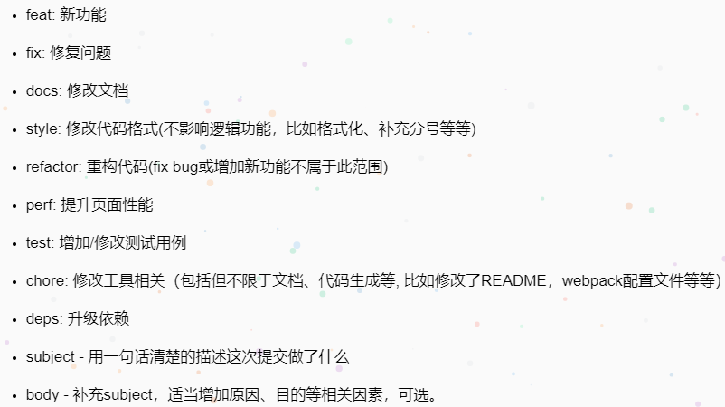

# vue-antd-admin

## 安装项目依赖

```shell
npm install
```

### 本地运行服务

```shell
npm start
```

### 编译打包

```shell
npm run build
```

### 打包分析

```shell
npm run analyze
```

### 代码校验

```shell
npm run lint
```

### 代码提交规范


